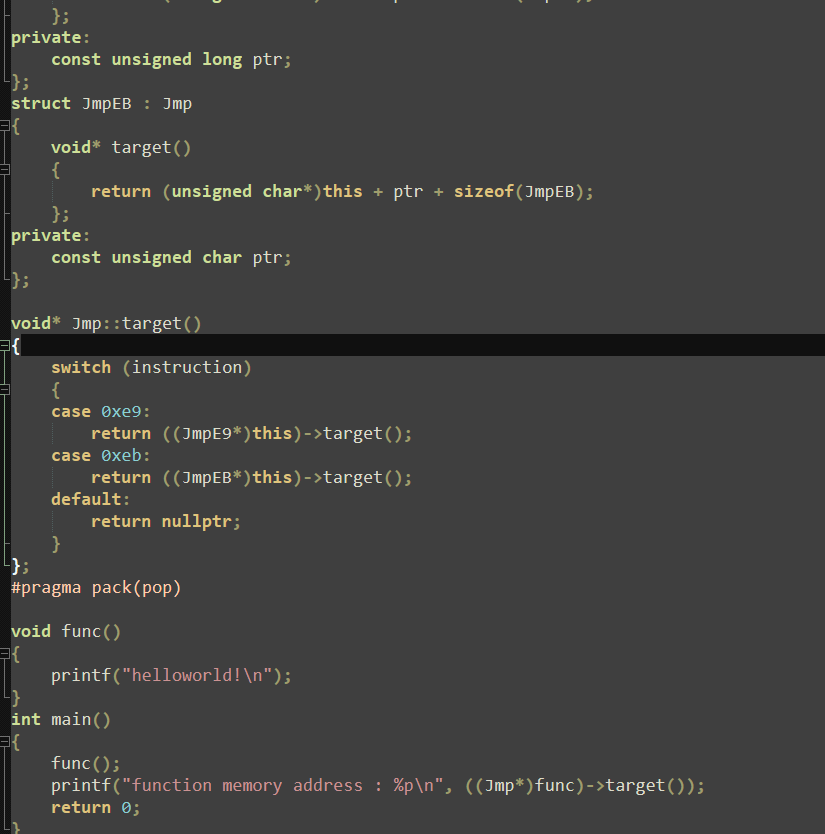

## 需求描述与实现思路
> /(0_0)/   \\(0_0)\

- [ ] 新闻早报
- [ ] ping
- [ ] nmap
- [ ] Linux报错解决方法
- [ ] 百科
- [ ] 小游戏
- [ ] 群文件分析
- 文件(普通文件)上传恶意分析平台进行识别
- 免杀白名单
- 返回分析报告
- [ ] 在线工具
- 加解密
- 在线程序运行
- 站长之家
- 钟道之眼
- [ ] 群文件md5
- [ ] jmp位移计算

- [ ] 人员活跃度统计
- 每周